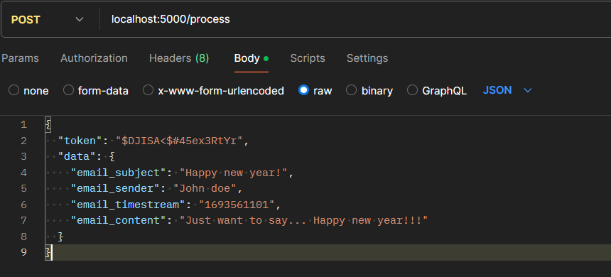

# Localstack

This repo's purpose is to store the Terraform infrastructure used in the assignment.
This repo will also contain the docker-compose.yaml file used to set up the three containers: the localstack, the publisher and the puller.

"microservice1" will be referred to here as "publisher1", "microservice2" will be referred to here as "puller2"

### About the code repos
- publisher1: https://github.com/Swiphf/publisher1
- puller2: https://github.com/Swiphf/puller2

I have chosen Github Actions as a CI tool and Python and Flask for the containers.
In each repo there is an explanation on how to trigger the CI as well as the entire source code.
The images will be uploaded to a public repo in Dockerhub.

---

## Prerequisites

Before you begin, ensure you have the following installed on your local machine:

- Docker
- Docker Compose
- AWS CLI
- Terraform
- LocalStack
- awscli-local (you can simply run "pip install awscli-local")
- terraform-local (you can simply run "pip install terraform-local")

## Setup Instructions

### 1. Clone the Repository

```sh
git clone https://github.com/swiphf/localstack.git
cd localstack-tf
```

### 2. Run the containers

```sh
docker network create localstack-network 
docker-compose pull
docker-compose up -d
```

### 3. Create the S3 and SQS

```
tflocal init
tflocal apply
```

### 4. Use Postman to test the application 
In this step you should use postman (or any other tool of your choice) and send a POST request to the publisher1 service.
The request should contain the following json body:



### 5. Validate the target S3
Now, (after a minimum of 10 seconds) you should check the S3 bucket to see if there is a new file corresponding your "timestream" field in the json.

Success example:


---

## Commands that you might want to use:
Empty an s3 bucket:
```
aws --endpoint-url=http://localhost:4566 s3 rm s3://my-bucket --recursive
```
Purge sqs queue:
```
aws --endpoint-url=http://localhost:4566 sqs purge-queue --queue-url http://localhost:4566/000000000000/my-queue
```
List an s3 bucket:
```
aws --endpoint-url=http://localhost:4566 s3 ls s3://my-bucket
```
